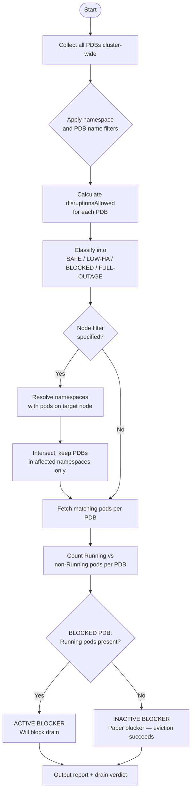
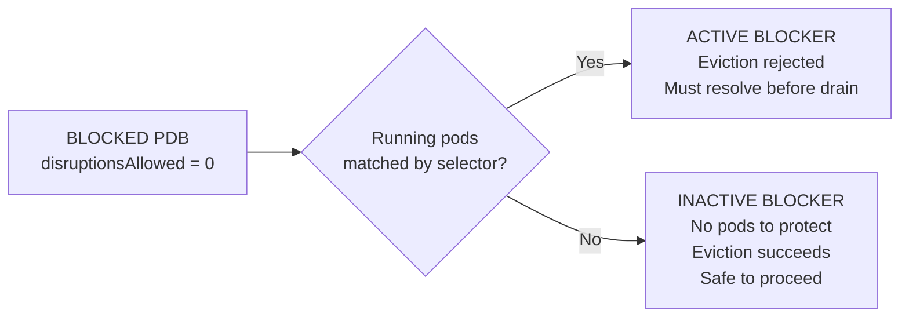
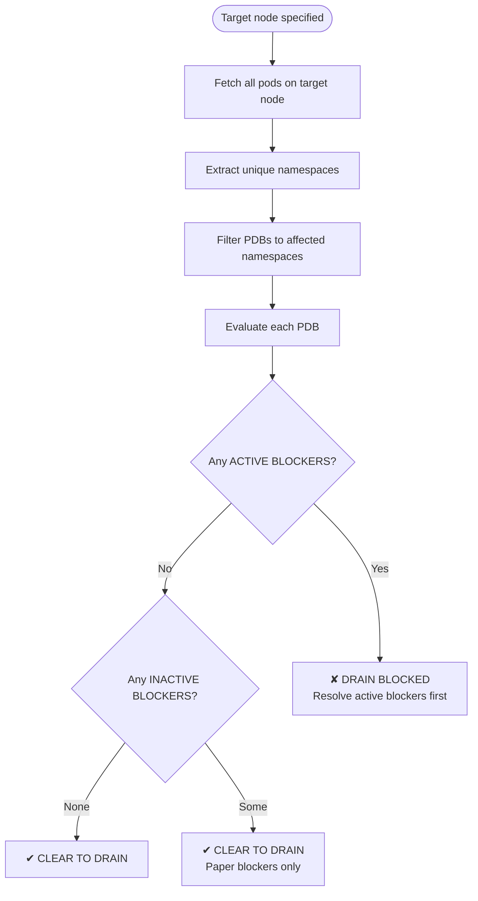

# PDB Blocker Checker — CLI Tool

> Cluster-wide PodDisruptionBudget analysis for OpenShift administrators. Determines maintenance safety, node drain viability, and HA health across all workload namespaces.

---

## Project Overview

PDB Blocker Checker is an operational CLI tool for OpenShift administrators. It evaluates every PodDisruptionBudget in the cluster and determines — using live Kubernetes disruption arithmetic — whether workloads can safely tolerate maintenance operations such as node drains, rolling upgrades, or operator updates.

The tool answers two critical operational questions:

1. **Is this node safe to drain right now?**
2. **Which PDBs will block maintenance, and why?**

It goes beyond raw `oc get pdb` output by resolving disruption headroom from live pod state, classifying PDB health into actionable severity tiers, and distinguishing between PDBs that will *actually* block eviction versus those that are configured as blocked but have no running pods to protect.

---

## Key Features

- **Accurate disruption calculation** using live `currentHealthy` and `expectedPods` — not static spec fields alone
- **Active vs. inactive blocker classification** — distinguishes real drain blockers from paper blockers
- **Node drain verdict** — binary `CLEAR TO DRAIN` / `DRAIN BLOCKED` with supporting evidence
- **Per-PDB pod inventory** — every matched pod, its node placement, and current phase
- **Namespace blast radius** — node filter resolves all namespaces with pods on the target node
- **System namespace exclusion** — `openshift-*` and `kube-*` filtered by default
- **Four-tier HA severity classification** with clear guidance per tier
- **Composable filters** — combine node, namespace, PDB name, and blocked-only flags

---

## Prerequisites

| Requirement | Detail |
|---|---|
| `oc` CLI | In `PATH`, logged in with an active session (`oc whoami` must succeed) |
| `jq` | Available via package manager or static binary |
| Cluster permissions | `get`, `list` on `pods`, `nodes`, `poddisruptionbudgets` cluster-wide |
| Bash | Version 4.0 or later |

The tool makes **read-only** API calls. No cluster state is modified.

---

## Business Logic

### Processing Flow



---

## PDB Classification

Every PDB is assigned one of four severity tiers based on computed disruption headroom as a percentage of expected pods.

| Status | Condition | Meaning |
|---|---|---|
| **BLOCKED** | `disruptionsAllowed = 0` | Zero pods can be evicted. Maintenance will be rejected. |
| **LOW-HA** | Headroom `> 0` and `< 30%` | Minimal tolerance. Proceed with caution. |
| **SAFE** | Headroom `≥ 30%` | Healthy budget. Maintenance can proceed. |
| **FULL-OUTAGE** | Headroom `= 100%` | PDB allows complete eviction — workload has no HA protection. |

### Active vs. Inactive Blockers



A PDB with `minAvailable: 3` and zero running pods still computes `disruptionsAllowed = 0` mathematically, but the Kubernetes eviction API will not block — there are no pods to evict. Treating such PDBs as real blockers causes unnecessary pre-drain work.

---

## Disruption Calculation

Headroom is computed from live cluster state. Results are clamped to zero — negative values indicate a workload already degraded beyond its threshold.

### `minAvailable` PDBs

```
disruptionsAllowed = currentHealthy − minAvailable
```

*Example: minAvailable=2, currentHealthy=3 → disruptionsAllowed=1*

### `maxUnavailable` PDBs

```
disruptionsAllowed = maxUnavailable − (expectedPods − currentHealthy)
```

*Example: maxUnavailable=1, expectedPods=3, currentHealthy=2 → 1−(3−2) = 0 → BLOCKED*

---

## Node Drain Analysis



| Verdict | Condition |
|---|---|
| `CLEAR TO DRAIN` | No BLOCKED PDBs in affected namespaces, or all BLOCKED PDBs are inactive |
| `DRAIN BLOCKED` | At least one ACTIVE BLOCKER in a namespace with pods on the target node |

---

## Filters

| Filter | Behaviour |
|---|---|
| `--namespace=<ns>` | Exact namespace match |
| `--pdb=<substring>` | Substring match on PDB name |
| `--node=<nodename>` | Scope to namespaces with pods on this node |
| `--blocked-only` | Show only ACTIVE BLOCKERS (disruptionsAllowed=0 + Running pods present) |
| `--include-system` | Include `openshift-*` and `kube-*` namespaces |

`--node` and `--blocked-only` combined activates **Node Drain Blocker Check** mode — the fastest pre-drain safety check.

---

## Usage Examples

```bash
# Full cluster PDB audit
./pdb_blocker_check.sh

# Pre-drain safety check for a specific node  (recommended before any drain)
./pdb_blocker_check.sh --node=ip-10-0-1-45.ec2.internal --blocked-only

# All PDBs in namespaces with pods on a node  (broader context view)
./pdb_blocker_check.sh --node=ip-10-0-1-45.ec2.internal

# All active blockers cluster-wide
./pdb_blocker_check.sh --blocked-only

# Drill into a specific application stack
./pdb_blocker_check.sh --pdb=kafka

# Single namespace audit
./pdb_blocker_check.sh --namespace=payment-service

# Namespace audit, active blockers only
./pdb_blocker_check.sh --namespace=payment-service --blocked-only

# Include OpenShift system namespaces  (useful before cluster upgrades)
./pdb_blocker_check.sh --include-system
```

---

## Sample Output

### Drain Verdict — Clear

```
  ✔  CLEAR TO DRAIN
  No blocking PDBs found in namespaces with pods on this node.
```

### Drain Verdict — Blocked

```
  ✘  DRAIN BLOCKED — 2 active PDB blocker(s) with Running pods
  Resolve the ACTIVE BLOCKED PDB(s) listed above before draining.
  Tip: scale up the workload or temporarily remove the PDB.
```

### Summary Report

```
  Blocked (disruptionsAllowed=0):          4
    ↳ Active blockers (Running pods):      2
    ↳ Inactive blockers (no Running pods): 2
  Low HA / Caution (<30% disrupts):        3
  Safe (>=30% disruptions allowed):       18
  Full outage (100% disruptions):          1

  Total PDBs displayed:                   26
```

### Per-PDB Block (Active Blocker)

```
  [BLOCKED]  NAMESPACE: payment-service  │  PDB: payment-api-pdb

  TYPE           minAvailable   EXPECTED   HEALTHY   DISRUPTIONS   PCT
  minAvailable   3              3          3         0             0%

  Selector : app=payment-api
  Pod count: 3 pod(s) matched  (Running: 3  |  Non-Running: 0)

  POD NAME                           NODE                        STATUS
  payment-api-7d4f9b-xkp2q          ip-10-0-1-45.ec2.internal   Running   ★ ON NODE
  payment-api-7d4f9b-mn3rt          ip-10-0-1-22.ec2.internal   Running
  payment-api-7d4f9b-qt8lz          ip-10-0-1-67.ec2.internal   Running

  Calculation:
    disruptionsAllowed = currentHealthy(3) - minAvailable(3) = 0
    → REAL BLOCKER: will block maintenance / node drain
```

---

## Limitations

- **Point-in-time** — results reflect cluster state at execution time
- **No webhook simulation** — does not invoke the eviction API; custom admission webhooks are not captured
- **`matchExpressions` not supported** — only `matchLabels` selectors resolved for pod matching
- **Percentage specs not resolved** — `minAvailable: "50%"` string values not converted to pod counts
- **Single cluster scope** — one cluster context per execution
- **Stateless** — no historical data; each run is independent
