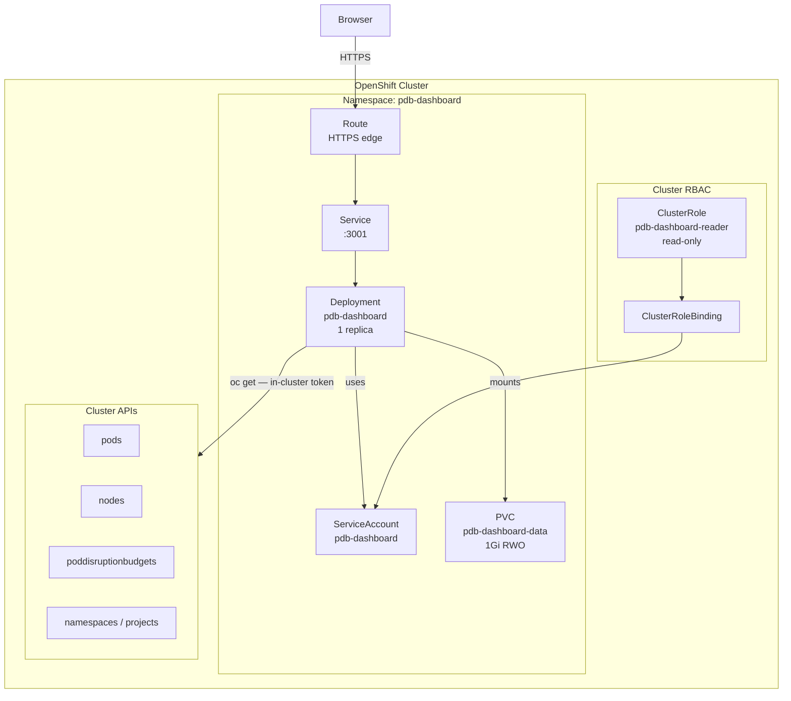
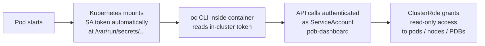

# PDB Dashboard — Web Application

> Persistent, always-on operational dashboard for PodDisruptionBudget analysis on OpenShift. Runs inside the cluster as a dedicated workload with in-cluster RBAC — no administrator token required at runtime.

---

## Project Overview

PDB Dashboard is the web-based evolution of the PDB Blocker Checker CLI tool. It deploys as a containerized workload inside your OpenShift cluster and provides a browser-accessible interface for continuous PDB health monitoring, node drain simulation, and historical trend analysis.

Unlike the CLI tool which requires an active `oc` session and produces terminal output, the web application runs persistently, auto-refreshes cluster state every 30 seconds via WebSocket push, and is accessible to any OpenShift administrator with network access to the Route — without distributing cluster tokens or running local tooling.

---

## Key Features

- **Real-time KPI dashboard** — blocked, active blockers, low-HA, safe, and full-outage counts with live refresh
- **Interactive PDB inventory** — sortable, filterable table with expandable pod detail and disruption formula per PDB
- **Node drain simulator** — select any node from a live list, receive instant `CLEAR TO DRAIN` / `DRAIN BLOCKED` verdict
- **Historical trend charts** — SQLite-backed snapshots track blocked PDB counts over time
- **WebSocket live push** — cluster state broadcast to all connected browsers every 30 seconds
- **CSV export** — full PDB inventory export for change advisory board submissions
- **In-cluster auth** — ServiceAccount with scoped ClusterRole; no operator token management required
- **HTTPS by default** — OpenShift Route with edge TLS termination and HTTP redirect

---

## Architecture



### Component Summary

| Component | Detail |
|---|---|
| **Deployment** | 1 replica, `Recreate` strategy (RWO PVC constraint) |
| **Container** | `node:20-slim` base, runs as UID 1000, all Linux capabilities dropped |
| **Service** | ClusterIP, port 3001 |
| **Route** | HTTPS edge termination, HTTP → HTTPS redirect |
| **PVC** | 1Gi RWO — SQLite database for history snapshots |
| **ServiceAccount** | Bound to `pdb-dashboard-reader` ClusterRole |

---

## Auth Model

The dashboard uses **in-cluster ServiceAccount authentication**. No administrator token is embedded in the deployment or passed at runtime.



### What the ServiceAccount Can Do

| API Group | Resource | Verbs |
|---|---|---|
| core | `pods` | get, list, watch |
| core | `nodes` | get, list, watch |
| core | `namespaces` | get, list, watch |
| `policy` | `poddisruptionbudgets` | get, list, watch |
| `policy` | `poddisruptionbudgets/status` | get |
| `project.openshift.io` | `projects` | get, list |
| `authentication.k8s.io` | `tokenreviews` | create |

**No write permissions are granted.** The ServiceAccount cannot modify any cluster resource.

### Browser Access

The Route exposes the dashboard over HTTPS using the cluster's default wildcard certificate. No additional authentication layer is implemented — access is controlled at the network level. If your cluster uses OpenShift OAuth for Route protection, apply an OAuth proxy sidecar or network policy as appropriate for your environment.

---

## Prerequisites

### Build Machine

| Requirement | Detail |
|---|---|
| **Podman** | Version 4.0 or later. On macOS: `brew install podman` + `podman machine start` |
| **oc binary** (`./oc`) | Linux/amd64 static binary placed in the repo root alongside `Containerfile`. Downloaded separately from [OpenShift mirror](https://mirror.openshift.com/pub/openshift-v4/clients/ocp/stable/). This binary is copied into the container image — it is not used on the build machine itself. |
| **Internet access** | Required during image build to pull `alpine:3.19` and `node:20-slim` base images. If building in a disconnected environment, mirror these to your internal registry first. |

### OpenShift Cluster

| Requirement | Detail |
|---|---|
| OCP version | 4.9 or later (`policy/v1` PDB API) |
| `oc` session | Active login with permission to create Namespace, ClusterRole, ClusterRoleBinding, Deployment, Service, Route, PVC |
| Quay registry | Self-hosted Quay reachable from cluster nodes for image pull |
| Storage class | Default storage class supporting `ReadWriteOnce` PVCs |

---

## Repository Structure

```
pdb-dashboard/
├── Containerfile              # Multi-stage image build (5 stages)
├── build.sh                   # Podman build wrapper
├── oc                         # linux/amd64 oc binary (not committed — place here before build)
├── backend/
│   ├── server.js              # Express + WebSocket server
│   ├── routes/api.js          # REST API endpoints
│   ├── services/
│   │   ├── oc.js              # oc CLI wrapper (in-cluster calls)
│   │   ├── pdbService.js      # PDB fetch + disruption calculation orchestration
│   │   └── db.js              # SQLite history snapshots
│   └── calculations/pdb.js    # Disruption arithmetic (mirrors CLI logic exactly)
├── frontend/
│   ├── src/
│   │   ├── App.js             # Theme, navigation, WebSocket client
│   │   └── pages/
│   │       ├── SummaryPage.js # KPI cards + status pie chart
│   │       ├── PDBTable.js    # Filterable sortable PDB inventory
│   │       ├── NodeDrain.js   # Node drain simulator
│   │       └── HistoryPage.js # Historical trend line chart
│   └── package.json
└── deploy/
    ├── 00-namespace.yaml      # Namespace with restricted pod-security labels
    ├── 01-rbac.yaml           # ServiceAccount + ClusterRole + ClusterRoleBinding
    ├── 02-deployment.yaml     # Deployment + Service + Route + PVC
    └── deploy.sh              # One-shot manifest apply script
```

---

## Build Steps

### Step 1 — Place the oc Binary

Download the linux/amd64 `oc` binary and place it in the repo root. This binary is copied into the container image at build time — internet access is not required inside the build for this step.

```bash
# From an internet-connected machine:
curl -fsSL https://mirror.openshift.com/pub/openshift-v4/clients/ocp/stable/openshift-client-linux-amd64.tar.gz \
  | tar -xzf - -C . oc

# Verify arch
file ./oc
# Expected: ELF 64-bit LSB executable, x86-64 ...
```

### Step 2 — Build the Image

```bash
# Default tag (pdb-dashboard:latest, linux/amd64)
./build.sh

# Custom tag
./build.sh --tag=pdb-dashboard:v1.0

# Explicit platform (required when building on macOS for Linux target)
./build.sh --tag=pdb-dashboard:v1.0 --platform=linux/amd64
```

The build script validates the `./oc` binary is present before invoking Podman. Build output confirms each stage and prints the final image architecture.

### Step 3 — Tag and Push to Quay

```bash
podman tag pdb-dashboard:v1.0 quay.your-domain.com/ops/pdb-dashboard:v1.0
podman push quay.your-domain.com/ops/pdb-dashboard:v1.0
```

If your Quay instance uses a self-signed certificate:

```bash
podman push --tls-verify=false quay.your-domain.com/ops/pdb-dashboard:v1.0
```

---

## Deployment Steps

### Step 1 — Update Image Reference

Edit `deploy/02-deployment.yaml` and replace the placeholder image with your pushed image:

```yaml
image: quay.your-domain.com/ops/pdb-dashboard:v1.0
```

### Step 2 — Configure Quay Pull Secret (if registry requires auth)

If your Quay repository is private, create an image pull secret and reference it in the deployment:

```bash
oc create secret docker-registry quay-pull-secret \
  --docker-server=quay.your-domain.com \
  --docker-username=<user> \
  --docker-password=<token> \
  -n pdb-dashboard

# Add to deploy/02-deployment.yaml under spec.template.spec:
# imagePullSecrets:
#   - name: quay-pull-secret
```

### Step 3 — Apply All Manifests

```bash
bash deploy/deploy.sh
```

This applies manifests in order: Namespace → RBAC → Deployment + Service + Route + PVC. It then waits for the deployment rollout and prints the Route URL.

Alternatively, apply individually:

```bash
oc apply -f deploy/00-namespace.yaml
oc apply -f deploy/01-rbac.yaml
oc apply -f deploy/02-deployment.yaml
```

### Step 4 — Verify Deployment

```bash
# Check pod is running
oc get pods -n pdb-dashboard

# Check route
oc get route pdb-dashboard -n pdb-dashboard

# Tail logs
oc logs -f deployment/pdb-dashboard -n pdb-dashboard

# Verify API is responding
curl -sk https://$(oc get route pdb-dashboard -n pdb-dashboard -o jsonpath='{.spec.host}')/api/summary
```

Expected log output on healthy start:

```
PDB Dashboard backend listening on :3001
Auto-refresh every 30s
[<timestamp>] Refresh done — <N> PDBs
```

---

## Deployed Resources

```
Namespace:            pdb-dashboard
  Deployment:         pdb-dashboard        (1 replica, Recreate)
  Service:            pdb-dashboard        (ClusterIP :3001)
  Route:              pdb-dashboard        (HTTPS edge, HTTP redirect)
  PVC:                pdb-dashboard-data   (1Gi RWO — SQLite)
  ServiceAccount:     pdb-dashboard
  ClusterRole:        pdb-dashboard-reader (read-only)
  ClusterRoleBinding: pdb-dashboard-reader
```

### Container Resource Limits

| | Request | Limit |
|---|---|---|
| CPU | 100m | 500m |
| Memory | 256Mi | 512Mi |

Container runs as **UID 1000**, non-root, with all Linux capabilities dropped and `allowPrivilegeEscalation: false`. Namespace enforces `restricted` pod security standard.

---

## Configuration

All configuration is set via environment variables in `deploy/02-deployment.yaml`.

| Variable | Default | Description |
|---|---|---|
| `PORT` | `3001` | HTTP listen port |
| `REFRESH_SECONDS` | `30` | Cluster state refresh interval |
| `OC_BIN` | `/usr/local/bin/oc` | Path to oc binary inside container |
| `DB_PATH` | `/app/data/pdb_history.db` | SQLite database path (on PVC) |

To change the refresh interval:

```bash
oc set env deployment/pdb-dashboard REFRESH_SECONDS=60 -n pdb-dashboard
```

---

## API Reference

All endpoints are read-only. No cluster state is modified via the API.

| Method | Path | Description |
|---|---|---|
| `GET` | `/api/summary` | Cluster-wide PDB counts by status |
| `GET` | `/api/pdbs` | Full PDB inventory with disruption detail. Query params: `namespace`, `pdb`, `status`, `blockedOnly`, `includeSystem` |
| `GET` | `/api/pdbs/:namespace/:name` | Single PDB with matched pods |
| `GET` | `/api/nodes` | Node list with roles and Ready status |
| `GET` | `/api/nodes/:node/drain-analysis` | Full drain verdict for a node |
| `GET` | `/api/namespaces` | Unique namespaces with PDBs |
| `GET` | `/api/export/csv` | Full PDB inventory as CSV download |
| `GET` | `/api/history` | Snapshot history (up to 200 entries) |
| `POST` | `/api/refresh` | Invalidate cache and force immediate refresh |
| `GET` | `/api/me` | Current ServiceAccount identity |
| `WS` | `/ws` | WebSocket — summary push on each refresh cycle |

---

## Updating the Image

```bash
# Build new version
./build.sh --tag=pdb-dashboard:v1.1

# Push to Quay
podman push quay.your-domain.com/ops/pdb-dashboard:v1.1

# Roll out new image
oc set image deployment/pdb-dashboard \
  pdb-dashboard=quay.your-domain.com/ops/pdb-dashboard:v1.1 \
  -n pdb-dashboard

# Watch rollout
oc rollout status deployment/pdb-dashboard -n pdb-dashboard
```

---

## Removing the Dashboard

```bash
oc delete namespace pdb-dashboard
oc delete clusterrole pdb-dashboard-reader
oc delete clusterrolebinding pdb-dashboard-reader
```

Deleting the namespace removes all namespaced resources including the PVC and SQLite history. The ClusterRole and ClusterRoleBinding are cluster-scoped and must be deleted separately.

---

## Limitations

- **Single cluster** — one deployment monitors one cluster. Multi-cluster support requires separate deployments per cluster or ACM integration.
- **RWO PVC** — only one replica can run. Scale-out requires migrating to a shared database.
- **No built-in auth** — Route access is network-controlled. Apply an OAuth proxy if user-level access control is required.
- **Percentage-based PDB specs** — `minAvailable: "50%"` string values are not resolved to pod counts; these PDBs report as unclassified.
- **History retention** — snapshot retention is unbounded. Prune the SQLite database manually if disk usage becomes a concern on long-running deployments.
